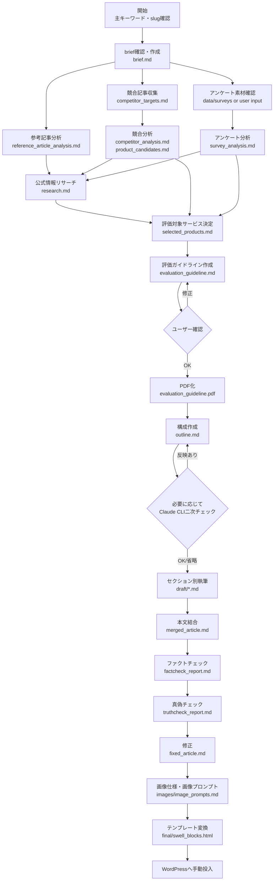
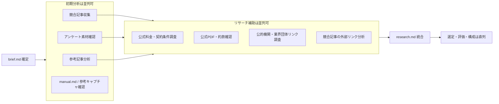
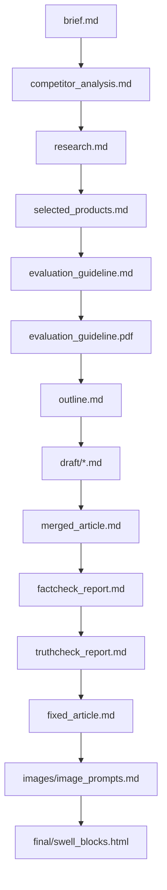
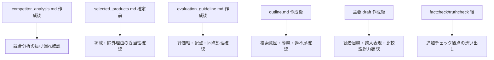

# Article Creation Workflow

SEO比較記事・レビュー記事・ランキング記事を作成するための作業フロー。  
基本は品質ゲートを直列に進めるが、調査・執筆・レビューの一部は並列化できる。

## 凡例

- **直列ゲート**: 次工程の前提になるため、順番を入れ替えない
- **並列可**: 同じ前提ファイルをもとに同時進行できる
- **確認ゲート**: ユーザー確認またはClaude CLI二次チェックを挟む候補
- **成果物**: `articles/<slug>/` 配下に残すファイル

## 全体フロー

## 並列化できる工程

## 直列で進めるべきゲート

直列にする理由:

- `selected_products.md` は、競合分析・アンケート分析・公式情報確認が揃ってから確定する
- `evaluation_guideline.md` は、評価対象サービス確定後でないと採点基準がぶれる
- `outline.md` は、評価ガイドライン確定後でないとランキング・比較表の根拠が弱くなる
- `merged_article.md` は、各セクションの前提と出典が揃ってから結合する
- `fixed_article.md` なしでテンプレート変換しない

## Claude CLI二次チェックの挿入ポイント

運用:

- CodexがClaude CLI貼り付け用プロンプトを作る
- ユーザーがClaude MaxプランのCLIで手動実行する
- Claude回答をCodexに貼り戻す
- Codexが `rules/`、公式情報、既存成果物と照合して反映可否を判断する

## 工程別の主な入力・出力

| 工程 | 主な入力 | 主な出力 | 並列可否 |
|---|---|---|---|
| brief確認 | 主キーワード、商材、参考URL | `brief.md` | 直列 |
| 参考記事分析 | `brief.md`, `xx.memo/url.md`, `xx.memo/manual/manual.md` | `reference_article_analysis.md` | 並列可 |
| 競合記事収集・分析 | `brief.md` | `competitor_targets.md`, `competitor_analysis.md`, `product_candidates.md` | 一部並列可 |
| アンケート分析 | アンケートデータ | `survey_analysis.md` | 並列可 |
| 公式情報リサーチ | `product_candidates.md`, 公式URL | `research.md`, `data/products/*.md`, `data/sources/*.md` | 並列可 |
| 評価対象決定 | `competitor_analysis.md`, `survey_analysis.md`, `research.md` | `selected_products.md` | 直列 |
| 評価ガイドライン | `selected_products.md`, `research.md` | `evaluation_guideline.md`, `evaluation_guideline.pdf` | 直列 |
| 構成作成 | すべての分析・評価ファイル | `outline.md` | 直列 |
| セクション別執筆 | `outline.md`, `research.md`, `survey_analysis.md` | `draft/*.md` | 並列可 |
| 本文結合 | `draft/*.md` | `merged_article.md` | 直列 |
| ファクトチェック | `merged_article.md`, `research.md` | `factcheck_report.md` | 直列 |
| 真偽チェック | `merged_article.md`, `factcheck_report.md` | `truthcheck_report.md` | 直列 |
| 修正 | `merged_article.md`, 各チェック結果 | `fixed_article.md` | 直列 |
| 画像仕様 | `fixed_article.md`, `outline.md` | `images/image_prompts.md` | 直列 |
| テンプレート変換 | `fixed_article.md`, 画像仕様 | `final/swell_blocks.html` | 直列 |

## 並列化時の注意

- 並列作業で得た情報は、最終的に `research.md`、`competitor_analysis.md`、`survey_analysis.md` などの正規成果物へ統合する
- 料金・キャンペーン・契約条件は、検索APIや競合記事ではなく公式情報で確認する
- 複数セクションを並列執筆する場合も、評価軸、順位、点数、用語、表記を `evaluation_guideline.md` に揃える
- 並列レビューの指摘は、そのまま採用せず `rules/` と公式情報に照合する
