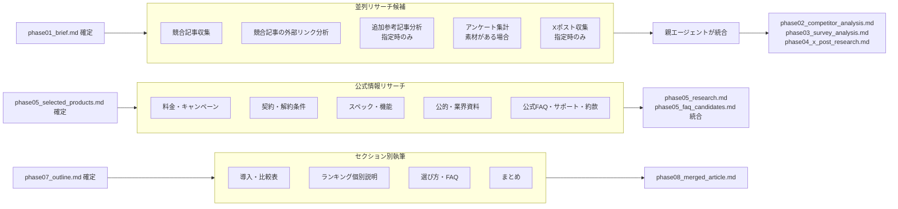
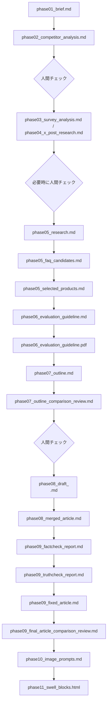

# Article Creation Workflow

SEO比較記事・レビュー記事・ランキング記事を作成するための作業フロー。  
基本は直列の品質ゲートを維持し、リサーチ・下書きなど分割可能な作業だけを並列化する。

## 凡例

- **直列ゲート**: 次工程の前提になるため、順番を崩さない
- **並列可**: 同じ前提ファイルをもとに同時進行できる
- **人間チェック**: ユーザー確認または修正指示を受けるまで次工程へ進まない
- **成果物**: `articles/<slug>/output/` 直下に `phaseXX_` 接頭辞付きで保存する

## フェーズ一覧

| フェーズ | 内容 | 主な成果物 | 備考 |
|---|---|---|---|
| フェーズ1 | brief確認・制作標準確認 | `phase01_brief.md` | `xx.memo/manual/manual.md` は常設制作標準として扱う |
| フェーズ2 | 競合記事収集・競合分析・商品サービス候補抽出 | `phase02_competitor_targets.md`, `phase02_competitor_analysis.md`, `phase02_product_candidates.md` | 必須。リサーチは並列可 |
| フェーズ2任意 | 追加参考記事分析 | `phase02_reference_article_analysis.md` | ユーザーが追加参考記事URLを指定した場合のみ |
| フェーズ3 | アンケート分析 | `phase03_survey_analysis.md` | アンケートがある場合は必須 |
| フェーズ4 | Xポストリサーチ | `phase04_x_post_research.md` | ユーザー指定時のみ |
| フェーズ5 | 公式情報リサーチ・FAQ候補抽出・評価対象サービス決定 | `phase05_research.md`, `phase05_faq_candidates.md`, `phase05_selected_products.md` | 公式情報リサーチとFAQ候補抽出は並列可 |
| フェーズ6 | 評価ガイドライン作成・確認・PDF化 | `phase06_evaluation_guideline.md`, `phase06_evaluation_guideline.pdf` | 必須 |
| フェーズ7 | 構成作成・構成比較検証 | `phase07_outline.md`, `phase07_outline_comparison_review.md` | 構成確認ゲートあり |
| フェーズ8 | セクション別本文作成・本文結合 | `phase08_draft_<section>.md`, `phase08_merged_article.md` | 下書きは並列可 |
| フェーズ9 | ファクトチェック・真偽チェック・修正・Fix後記事比較検証 | `phase09_factcheck_report.md`, `phase09_truthcheck_report.md`, `phase09_fixed_article.md`, `phase09_final_article_comparison_review.md` | 画像以外の記事内容をFixする |
| フェーズ10 | 画像仕様書・画像プロンプト作成 | `phase10_image_prompts.md` | 本文Fix後 |
| フェーズ11 | テンプレート変換・WordPress手動投入 | `phase11_swell_blocks.html`, `phase11_<template>_blocks.html` | 最終出力 |

## 全体フロー

```mermaid
flowchart TD
  A[開始<br/>主キーワード・slug確認] --> B[フェーズ1: brief確認<br/>phase01_brief.md]
  B --> C0[制作標準確認<br/>xx.memo/manual/manual.md<br/>content_quality_manual_policy.md]
  B --> C1{追加参考記事URLあり?}
  C1 -->|あり| C1A[追加参考記事分析<br/>phase02_reference_article_analysis.md]
  C1 -->|なし| C2
  C1A --> C2[フェーズ2: 競合記事収集<br/>phase02_competitor_targets.md]
  C2 --> D[競合分析・候補抽出<br/>phase02_competitor_analysis.md<br/>phase02_product_candidates.md]
  D --> DCheck{人間チェック<br/>競合記事での商品・サービス評価状況}
  DCheck -->|修正| D
  DCheck -->|OK| E{アンケートあり?}
  E -->|あり| E1[フェーズ3: アンケート分析<br/>phase03_survey_analysis.md]
  E1 --> ECheck{人間チェック<br/>傾向・示唆確認}
  ECheck -->|修正| E1
  E -->|なし| X
  ECheck -->|OK| X{Xポストリサーチ指定あり?}
  X -->|あり| X1[フェーズ4: Xポストリサーチ<br/>phase04_x_post_research.md]
  X -->|なし| F
  X1 --> F[フェーズ5: 公式情報リサーチ<br/>phase05_research.md]
  F --> FQ[FAQ候補抽出・採用方針<br/>phase05_faq_candidates.md]
  FQ --> G[評価対象サービス決定<br/>phase05_selected_products.md]
  G --> H[フェーズ6: 評価ガイドライン作成<br/>phase06_evaluation_guideline.md]
  H --> HCheck{ユーザー確認}
  HCheck -->|修正| H
  HCheck -->|OK| HPdf[PDF化<br/>phase06_evaluation_guideline.pdf]
  HPdf --> I[フェーズ7: 構成作成<br/>phase07_outline.md]
  I --> IR[構成比較検証<br/>phase07_outline_comparison_review.md]
  IR --> ICheck{人間チェック<br/>順番・過不足確認}
  ICheck -->|修正| I
  ICheck -->|OK| J[フェーズ8: セクション別執筆<br/>phase08_draft_<section>.md]
  J --> K[本文結合<br/>phase08_merged_article.md]
  K --> L[フェーズ9: ファクトチェック<br/>phase09_factcheck_report.md]
  L --> M[真偽チェック<br/>phase09_truthcheck_report.md]
  M --> N[修正<br/>phase09_fixed_article.md]
  N --> NR[Fix後記事比較検証<br/>phase09_final_article_comparison_review.md]
  NR --> O[フェーズ10: 画像仕様<br/>phase10_image_prompts.md]
  O --> P[フェーズ11: テンプレート変換<br/>phase11_swell_blocks.html]
```

## 並列化できる工程

## 直列ゲート

## 工程別入出力

| 工程 | 入力 | 出力 | 並列可否 |
|---|---|---|---|
| brief確認 | 主キーワード、商材、参考URL | `phase01_brief.md` | 直列 |
| 追加参考記事分析 | `phase01_brief.md`, ユーザー指定URL | `phase02_reference_article_analysis.md` | 指定時のみ並列可 |
| 競合記事収集・分析 | `phase01_brief.md` | `phase02_competitor_targets.md`, `phase02_competitor_analysis.md`, `phase02_product_candidates.md` | 一部並列可 |
| アンケート分析 | アンケートデータ | `phase03_survey_analysis.md` | 並列可 |
| Xポストリサーチ | ユーザー指定、検索クエリ、商品・サービス候補 | `phase04_x_post_research.md` | 指定時のみ並列可 |
| 公式情報リサーチ | `phase02_product_candidates.md`, 公式URL | `phase05_research.md`, `data/products/*.md`, `data/sources/*.md` | 並列可 |
| FAQ候補抽出 | `phase02_competitor_analysis.md`, `phase03_survey_analysis.md`, `phase05_research.md`, 公式FAQ・サポートURL | `phase05_faq_candidates.md` | 並列可 |
| 評価対象決定 | `phase02_competitor_analysis.md`, `phase03_survey_analysis.md`, `phase05_research.md` | `phase05_selected_products.md` | 直列 |
| 評価ガイドライン | `phase05_selected_products.md`, `phase05_research.md` | `phase06_evaluation_guideline.md`, `phase06_evaluation_guideline.pdf` | 直列 |
| 構成作成 | すべての分析・評価ファイル、`phase05_faq_candidates.md` | `phase07_outline.md` | 直列 |
| 構成比較検証 | `phase07_outline.md`, `phase02_competitor_analysis.md`, 常設制作標準 | `phase07_outline_comparison_review.md` | 直列 |
| セクション別執筆 | `phase07_outline.md`, `phase05_research.md`, `phase03_survey_analysis.md` | `phase08_draft_<section>.md` | 並列可 |
| 本文結合 | `phase08_draft_<section>.md` | `phase08_merged_article.md` | 直列 |
| ファクトチェック | `phase08_merged_article.md`, `phase05_research.md` | `phase09_factcheck_report.md` | 直列 |
| 真偽チェック | `phase08_merged_article.md`, `phase09_factcheck_report.md` | `phase09_truthcheck_report.md` | 直列 |
| 修正 | `phase08_merged_article.md`, 各チェック結果 | `phase09_fixed_article.md` | 直列 |
| Fix後記事比較検証 | `phase09_fixed_article.md`, `phase02_competitor_analysis.md`, 各チェック結果 | `phase09_final_article_comparison_review.md` | 直列 |
| 画像仕様 | `phase09_fixed_article.md`, `phase07_outline.md` | `phase10_image_prompts.md` | 直列 |
| テンプレート変換 | `phase09_fixed_article.md`, 画像仕様 | `phase11_swell_blocks.html` | 直列 |

並列作業で得た情報は、親エージェントが確認し、正規成果物へ統合する。サブエージェントを使う場合も、最終判断と品質ゲート通過は親エージェントが行う。
