# 最強コンテンツ作成マニュアル

元ファイル: `xx.memo/manual.docx`

このMarkdownは、DOCX本文とDOCX内に画像として貼られていた参考キャプチャを、今後参照しやすいように整理したものです。

## 主な目的

Googleが特に評価する要素として、以下の3つを重視する。

### 1. 体験

- 著者情報の追加
- 著者によるコメント
- 実機検証などの実体験コンテンツ

### 2. 一次情報

- アンケートをさまざまなh2/h3内の文脈で何度も使う

### 3. 独自情報

- インタビュー
- 診断コンテンツ
- ソート機能
- アンケート
- 著者情報
- 実体験検証コンテンツ

## 0. テスト記事

URL:

- https://monster-mobile.jp/net-kaisen/pocket-wifi-osusume/

## 1. アイキャッチ

タイトル + 左に女性 + 右に体験画像 + 下に結論。

参考例:

- https://my-best.com/2343


## 2. リード文

推奨の流れ:

1. リード文
2. 案件一覧図解
3. リード文
4. 目的別結論 + アンケートで選ばれている訴求
5. ランキングリストタグ + 基準PDF（アコーディオン）
6. アンケート結果1位訴求 + アンケート結果PDF（アコーディオン）
7. 診断コンテンツまたはソート機能
8. この記事でわかること
9. 監修、著者プロフィール
10. 目次

### 案件一覧図解

参考:

- https://monster-mobile.jp/net-kaisen/pocket-wifi-osusume/

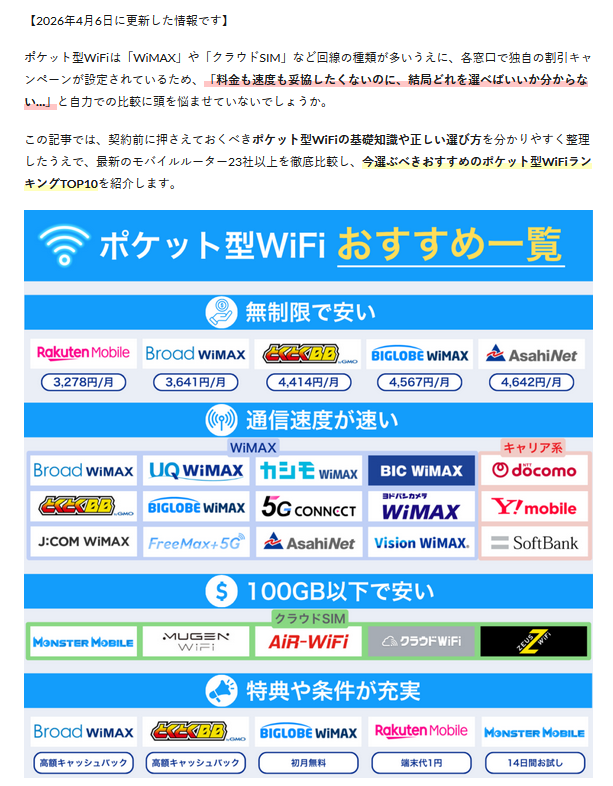

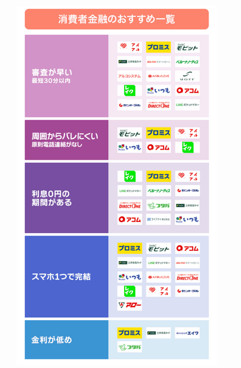

### アンケート結果・評価基準の訴求

参考:

- https://www.jkeiei.co.jp/m/column-consumer-finance-osusume/

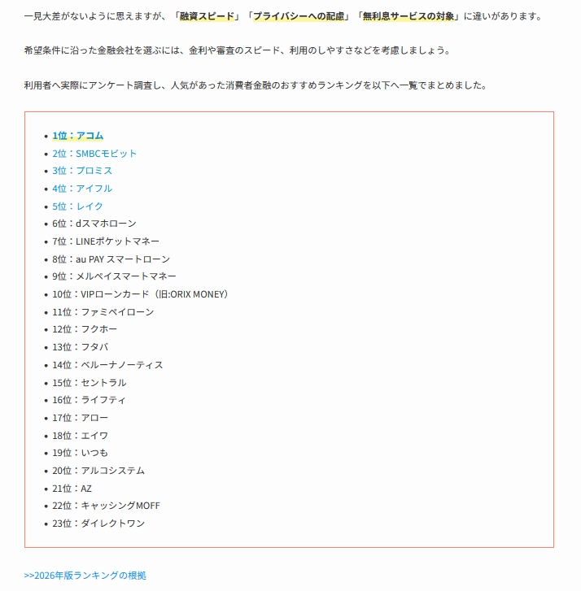

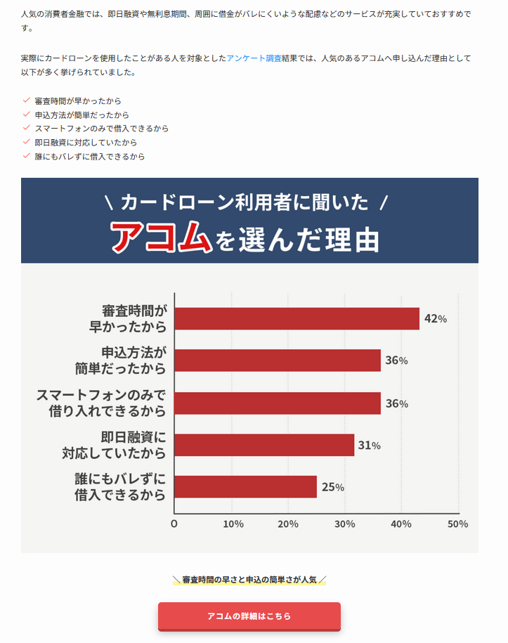

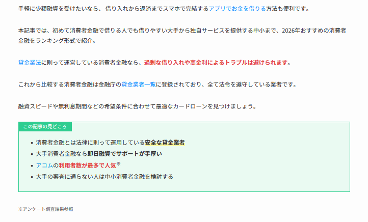

### 診断コンテンツ・ソート機能

参考:

- https://www.fvc.co.jp/finance/consumer-finance-recommended/

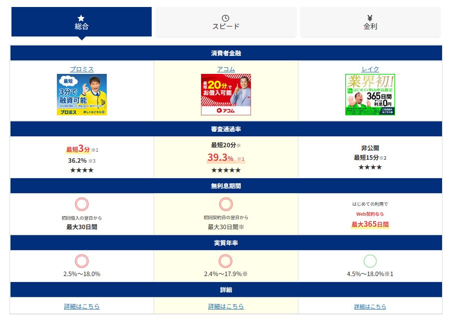

### 監修・著者プロフィール

参考:

- https://realnet-engineering.jp/mobile/top-ranking/
- https://my-best.com/2343
- https://customlife.co.jp/cl-med/self-hair-removal-ranking-osusume/

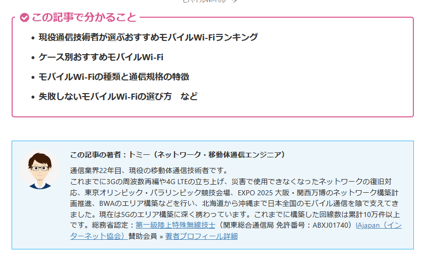

## 3. 一次情報アピール

想定h2:

```text
【まず確認】当記事で紹介するポケット型WiFiの選定基準と1次情報について
```

入れる要素:

- アンケート結果（一次情報アピール項目）
- インタビュー（独自情報アピール項目）
- ジャンルに精通のある著者による経験談（信頼性 + 体験アピール項目）
- ポケット型WiFi実機検証（実体験アピール項目）
- 記事監修（信頼性担保、ドメイン貸しの見え方排除）

参考:

- https://www.fvc.co.jp/finance/consumer-finance-recommended/
- https://my-best.com/2343

### アンケート結果

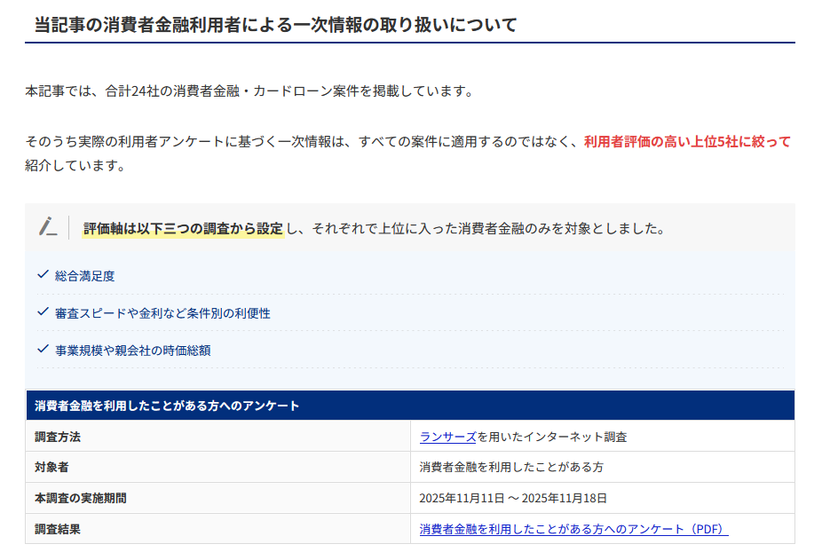

### インタビュー

該当スクリーンショットは見つけられず。

### 著者経験談

該当スクリーンショットは見つけられず。

### 実機検証・実体験

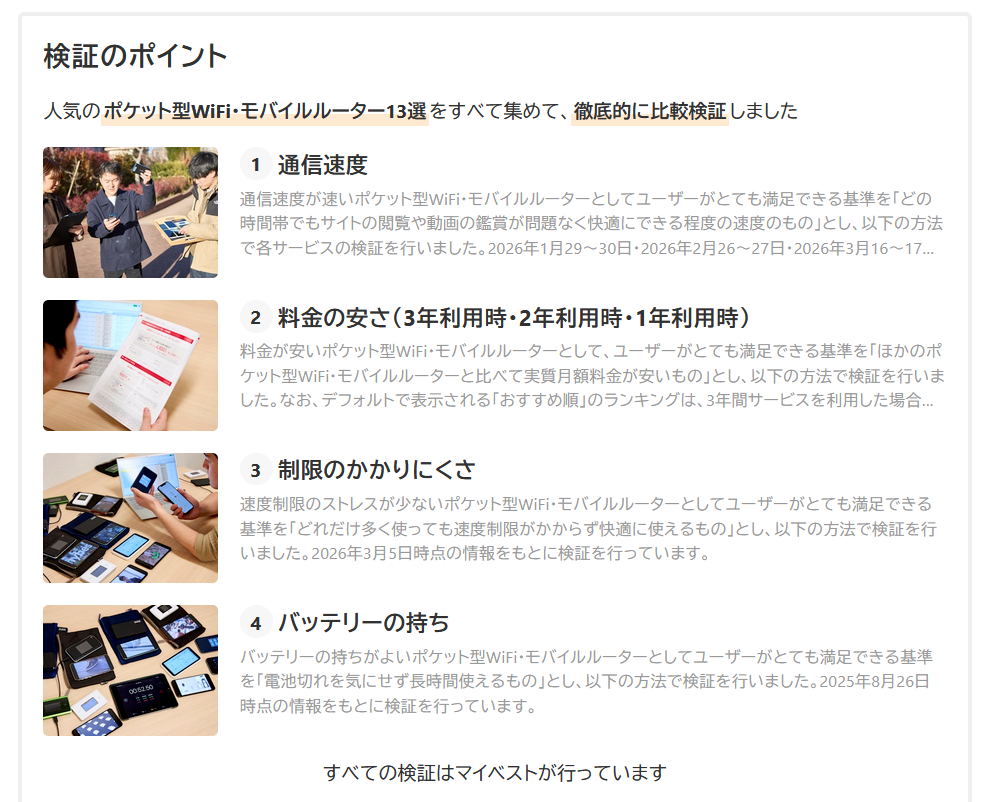

### 記事監修

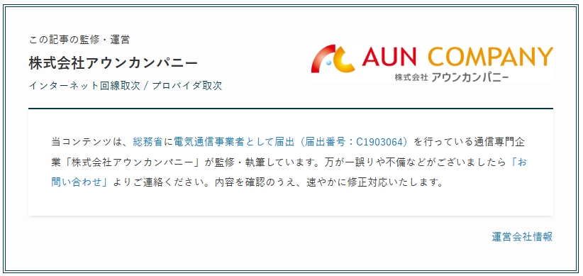

## 4. 結論

通常の結論の作り方に加えて、以下を入れる。

- 著者の実体験コメントを一番下に必ず入れる
- アンケート結果で追加訴求する

参考:

- https://monster-mobile.jp/net-kaisen/pocket-wifi-osusume/#conclusion

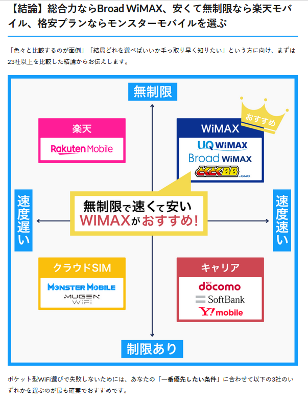

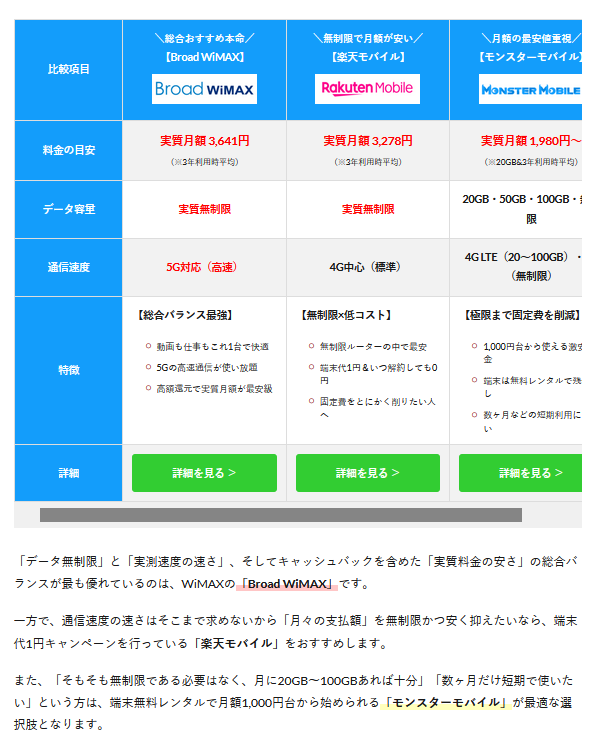

## 5. 選び方

- 案件まで選択できる説明ロジックにする
- アンケート結果で追加訴求する
- 著者の実体験コメントを一番下に必ず入れる

参考:

- https://customlife.co.jp/cl-med/self-hair-removal-ranking-osusume/

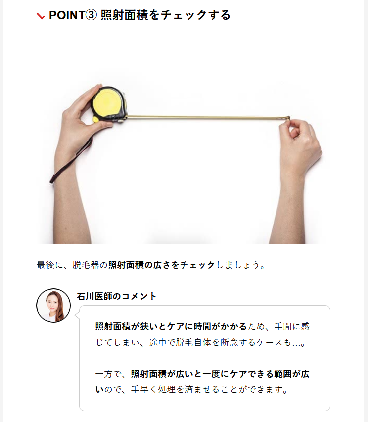

## 6. 比較表

ただの比較ではなく、選択・ソート・絞り込みなどができる形にパワーアップさせる。

参考:

- https://www.fvc.co.jp/finance/consumer-finance-recommended/#acom
- https://my-best.com/2343

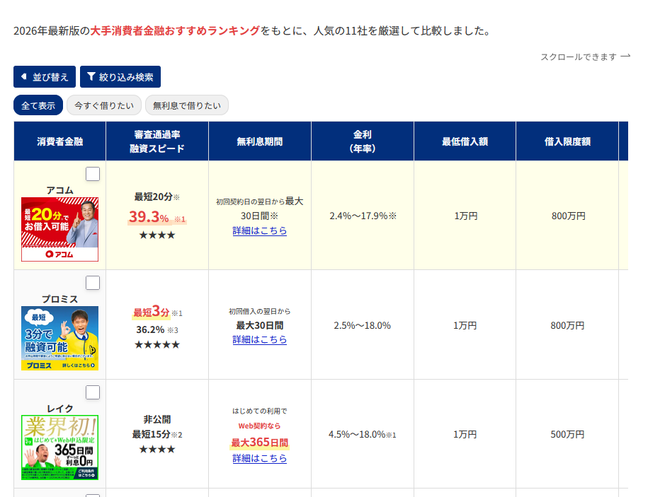

## 7. 案件紹介

従来の案件紹介に加えて、以下を入れる。

- アンケート結果を評価項目に追加する
- 著者のコメントをアフィリエイトリンクボタン手前に入れる
- 一次情報口コミ3件を入れる（アンケート結果より + PDF）
- 実体験による独自情報を入れる
  - ポケットWiFiの場合は実機検証結果、オリジナル画像など
- 1位案件のみインタビューコンテンツを追加する
  - 最終的にやること

参考:

- https://monster-mobile.jp/net-kaisen/pocket-wifi-osusume/#broad
- https://www.fvc.co.jp/finance/consumer-finance-recommended/#acom
- https://xn--wimax-lu8k074r.com/pocket_wifi.html

### アンケート結果を評価項目に追加

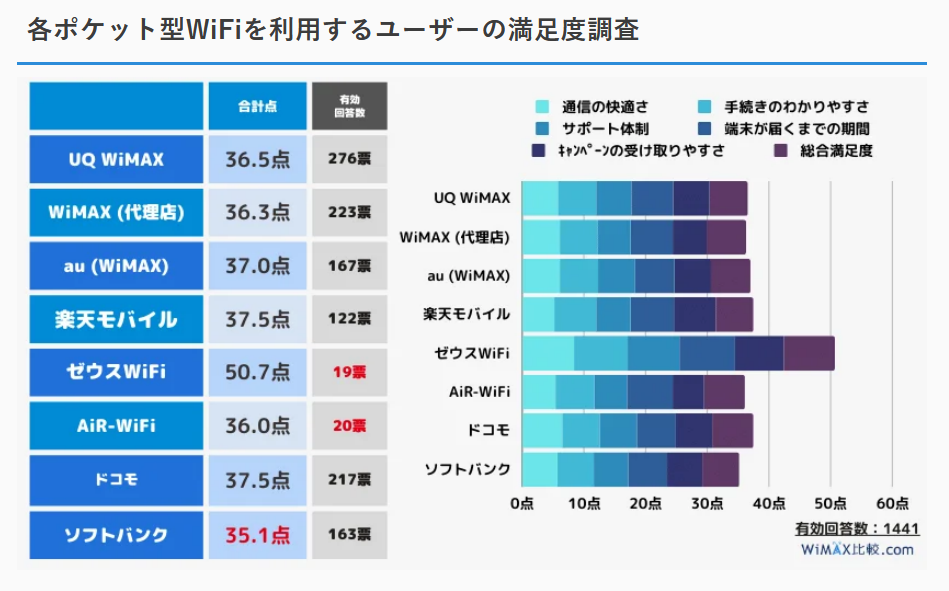

### 著者コメントをCTA前に配置

該当URLで見つからなかったため、代替URLとして以下を確認。

- https://auncompany.co.jp/media/hikari-internet/cashback/

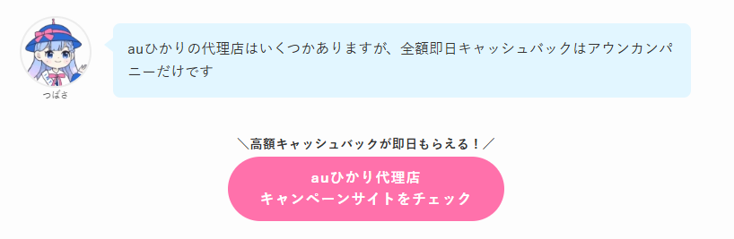

### 一次情報口コミ3件

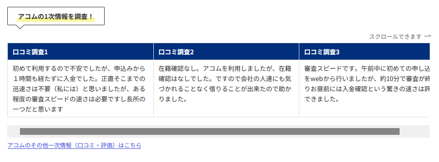

### 実体験による独自情報

参考:

- https://my-best.com/2343
- https://xn--wimax-lu8k074r.com/pocket_wifi.html
- https://www.showcase-tv.com/sim/sim-speed-investigation/

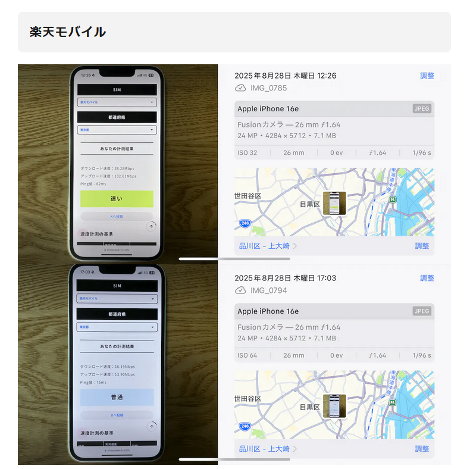

## 8. その他h2/h3

- 必ず図解を1枚は入れる
- 著者の実体験コメントを一番下に必ず入れる
- 表、比較表、引用、発リンク、リストタグ、アコーディオン、注釈のうち3つ以上は使う

### 図解

参考:

- https://www.fvc.co.jp/finance/cardloan-without-enrollment/
- https://www.fvc.co.jp/finance/interest-free-cardloan/

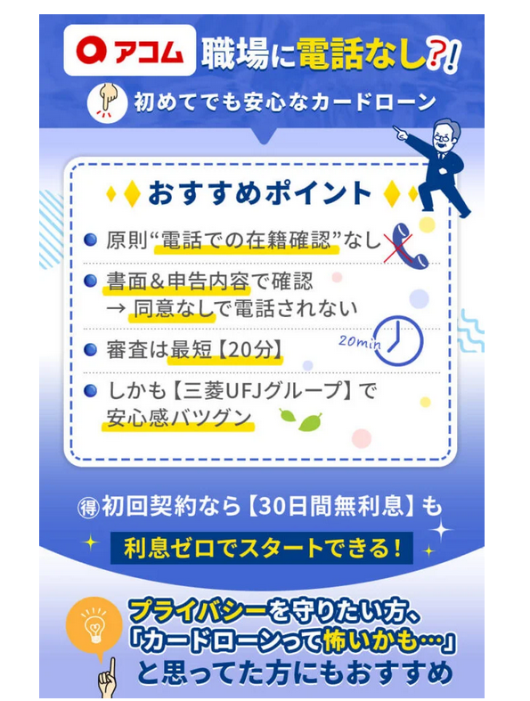

### 著者の実体験コメント

参考:

- https://www.uktsc.com/thestyledictionary/beard-hair-removal-tokyo

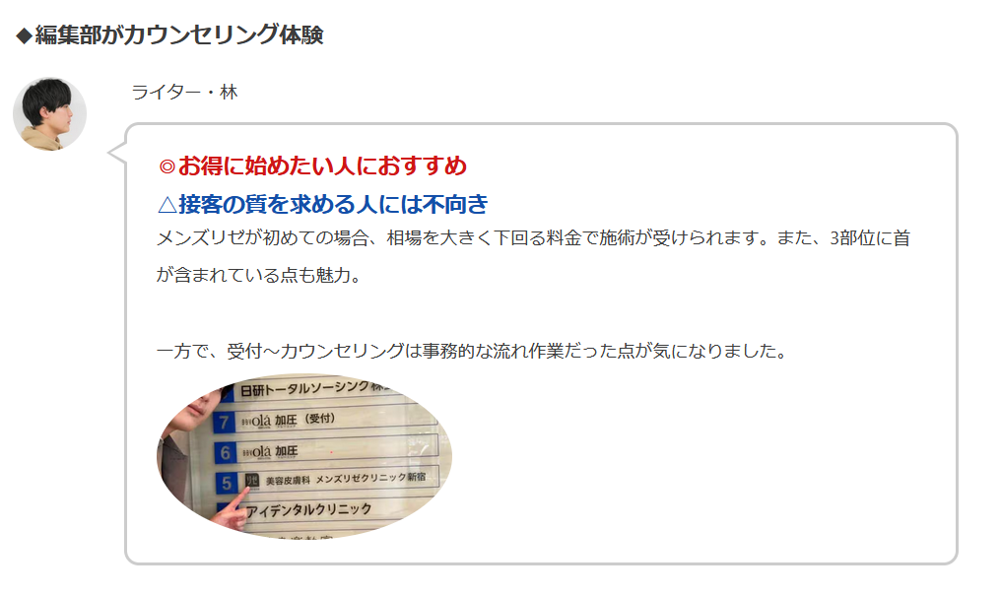

### 表・比較表・引用・発リンク・リストタグ・アコーディオン・注釈

参考:

- https://www.fvc.co.jp/finance/cardloan-without-enrollment/
- https://www.fvc.co.jp/finance/interest-free-cardloan/
- https://www.irrc.co.jp/consumerfinance/
- https://www.uktsc.com/thestyledictionary/beard-hair-removal-tokyo
- https://www.jkeiei.co.jp/m/column-consumer-finance-osusume/
- https://customlife.co.jp/cl-med/self-hair-removal-ranking-osusume/

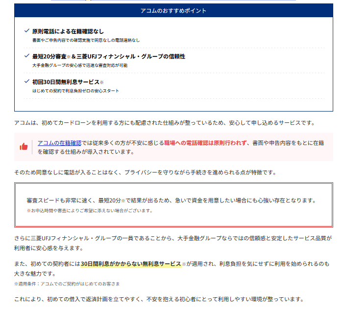

## 9. 補足

### 1. 検索意図に対して的確なタイトル設定

- 複数の検索意図の中から1つを選んでタイトルを作る
- 選定基準は1位記事の検索意図と同じにする

### 2. タイトルの内容に完全マッチした記事構成

- 関係ないh2/h3をカットする
- 狭く深くを意識する
- 上から読んでストーリーになること
- 自分の目的や条件に合った商品を迷わず選べるように導く記事構成にする

### 3. 結論ファーストの記事一覧

- リード文の中に入れる
- 最初のh2に入れる

### 4. 1つの見出しで使う要素

1つの見出しに対して、以下を3個以上は使用する。

- 表
- 比較表
- 引用
- 発リンク
- 図解
- リストタグ
- アコーディオン
- 注釈

## 参考URL一覧

- https://monster-mobile.jp/net-kaisen/pocket-wifi-osusume/
- https://monster-mobile.jp/net-kaisen/pocket-wifi-osusume/#broad
- https://monster-mobile.jp/net-kaisen/pocket-wifi-osusume/#conclusion
- https://my-best.com/2343
- https://www.jkeiei.co.jp/m/column-consumer-finance-osusume/
- https://www.fvc.co.jp/finance/consumer-finance-recommended/
- https://www.fvc.co.jp/finance/consumer-finance-recommended/#acom
- https://realnet-engineering.jp/mobile/top-ranking/
- https://customlife.co.jp/cl-med/self-hair-removal-ranking-osusume/
- https://xn--wimax-lu8k074r.com/pocket_wifi.html
- https://auncompany.co.jp/media/hikari-internet/cashback/
- https://www.showcase-tv.com/sim/sim-speed-investigation/
- https://www.fvc.co.jp/finance/cardloan-without-enrollment/
- https://www.fvc.co.jp/finance/interest-free-cardloan/
- https://www.uktsc.com/thestyledictionary/beard-hair-removal-tokyo
- https://www.irrc.co.jp/consumerfinance/
